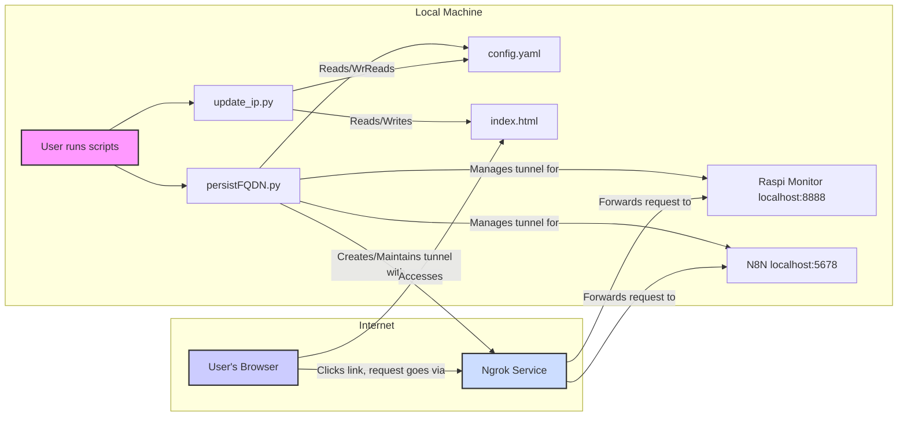

# Project Architecture Plan

## Overview

This system exposes local services (like Raspi Monitor, N8N) to the public internet using `ngrok` and provides a simple web portal (`index.html`) for access.

## Components

1.  **`config.yaml`**: Configuration file defining local services (name, port, tag). Dynamically updated by `persistFQDN.py` with ngrok FQDNs.
2.  **`persistFQDN.py`**:
    *   Reads `config.yaml`.
    *   Starts ngrok tunnels for each service.
    *   Retrieves public FQDNs.
    *   Updates `config.yaml` with FQDNs.
    *   Keeps tunnels active.
3.  **`update_ip.py`**:
    *   Reads `config.yaml` (with FQDNs).
    *   Reads `index.html`.
    *   Updates `href` attributes and display text in `index.html` based on service tags/names and FQDNs using regex.
4.  **`index.html`**: Static HTML portal page with links to services. Links are updated by `update_ip.py`.
5.  **Local Services**: Applications running locally (e.g., Raspi Monitor on port 8888, N8N on port 5678).
6.  **Ngrok Service**: Third-party service providing tunneling and public FQDNs.
7.  **User**: Accesses services via `index.html` in a browser.

## Workflow

1.  **Configure**: Define services and ports in `config.yaml`.
2.  **Start Tunnels**: Run `persistFQDN.py`.
3.  **Persist FQDNs**: `persistFQDN.py` gets FQDNs from ngrok and saves them back to `config.yaml`. Script keeps running.
4.  **Update Portal**: Run `update_ip.py`.
5.  **Generate HTML**: `update_ip.py` updates links in `index.html` using FQDNs from `config.yaml`.
6.  **Access**: User opens `index.html` in a browser and clicks links to access services via ngrok.

## Architecture Diagram (Mermaid)

